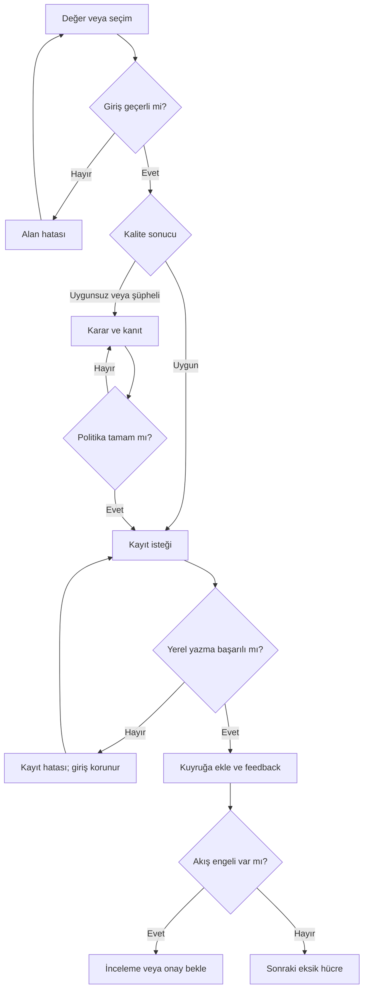
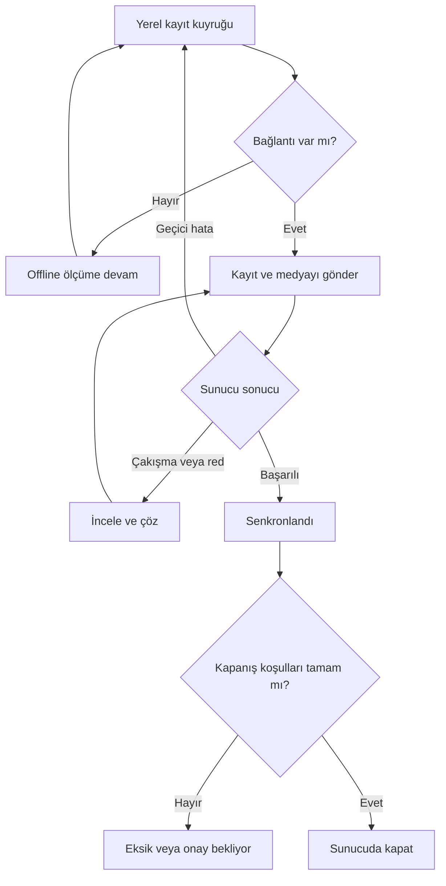

# Ritim Quality Mobile Measurement UX Specification

**Sürüm:** 1.0 · **Tarih:** 30 Eylül 2026  
**Dil:** Türkçe · **Hedef:** Tasarım, frontend, backend ve saha kabulü için ortak geliştirme referansı.

## 1. Amaç ve kapsam

Operatör, teknik resimde ölçtüğü noktayı görürken nominal, alt ve üst sınırları okuyabilmeli; ölçümü tek elle girebilmeli; uygunsuz sonuç için fotoğraf ve açıklama ekleyebilmeli. Bir kontrol oturumu 1–5 numune ve her numunede 1–50 karakteristik içerebilir. Beş numune ve elli karakteristik, toplam 250 sonuç hücresi anlamına gelir.

Bu belge, bu konuşmada paylaşılan tasarım kararlarını birleştirir. Önceki ekran çizimlerinin tamamı ve önceki 18+18 listesi bu oturumda bulunmadığından, aşağıdaki 36 maddelik envanter yeniden düzenlenmiş uygulama temelidir; mevcut çizimlerin birebir doğrulanmış dökümü değildir. “Eksik ekran” sütunu önceki konuşmada açık kalan senaryoları belirtir; bir ekranın gerçekten çizilip çizilmediği iddiası değildir.

**Bu sürümün kapsamı:** measurement shell, giriş tipleri, kanıt, tekrar ölçüm, gezinme, taslak, offline, senkronizasyon, revizyon ve kapanış. Bluetooth cihaz entegrasyonu genişletme noktasıdır; çalışan bir cihaz bağlantısı bu UX belgesinin tamamlanma koşulu değildir. Plan editörü, SPC dashboard ve genel görev yönetimi ayrı modüllerdir.

**Görsel referans:** https://serkandemirhan.github.io/ritimQualityWebSite/  
Siteye bu oturumda yeniden erişilemedi. Görsel öneriler önceki konuşmadaki marka tarifinden türetilmiştir; hex değerleri, font ve ölçüler site CSS’inden alınmış doğrulanmış değerler değildir. Son tasarımda site kaynaklarıyla eşleştirilmelidir.

## 2. Temel ürün kararları

| Konu | Bu sürümde uygulanacak karar |
|---|---|
| Varsayılan sıra | Numune bazlı: S1 için C1…C50, sonra S2. |
| Alternatif sıra | Karakteristik bazlı: C1 için S1…S5, sonra C2. |
| Kaydetme | Açık “Kaydet ve ilerle” aksiyonu veya fiziksel Enter. Sadece sayı yazılması kayıt oluşturmaz. |
| Otomatik ilerleme | Başarılı yerel kalıcı kayıt sonrasında; kanıt, review ve onay engeli varsa durur. |
| Değer değerlendirmesi | Yazarken önizleme; kayıt anında kesin doğrulama. “Uygun · Henüz kaydedilmedi” açık gösterilir. |
| Ana giriş | Mutlak değer. Nominalden sapma modu isteğe bağlı ve etiketli. |
| Teknik resim | Kompakt ve sürekli görünür; büyütme modu ayrı. Açıklama klavyesi ve modal kanıt işlemleri geçici istisnadır. |
| Ölçüm tipi | Sayısal, OK/NOK, görsel/şüpheli, tek seçim, metin, evet/hayır. |
| Uygunsuzluk | Renkli sinyal + açıklama; tüm ekran kırmızıya dönmez. |
| Tekrar ölçüm | Önceki sonuç korunur; yeni attempt eklenir. Uygunsuzluk otomatik silinmez. |
| Offline | İzinli ve önceden indirilmiş planla devam; kayıt yerelde saklanır. Sunucu kapanışı ve onay çevrimiçi tamamlanır. |
| Sağ/sol el | Kullanıcının açık tercihi; aksiyonların yerleşimi aynalanır, sayı tuşlarının sırası değişmez. |
| Tamamlanma | Veri toplama, kalite kararı ve senkron durumu ayrı gösterilir. |

Bu kararlar önerilen uygulama varsayılanlarıdır. Kanıt adedi, onay gerekliliği, N/A izni ve ölçü aleti zorunluluğu revizyonlu kontrol planında belirlenir.

## 3. Görsel sistem

Ölçüm değeri ekranın görsel merkezidir. Yüzeyler nötr, çizgiler ince, teknik resim beyaz bir mühendislik alanıdır. Renk yalnızca aktif nokta ve anlamlı durumu güçlendirir. Pazarlama sitesindeki dramatik görünüm, operatör ekranında okunabilirliğe uyarlanır.

| Token | Önerilen başlangıç değeri | Kullanım |
|---|---|---|
| ink | #142438 | Ana metin, başlık, ana aksiyon |
| canvas | #F4F3EF | Kırık beyaz uygulama zemini |
| surface | #FFFFFF | Resim, giriş ve sheet yüzeyi |
| line | #D8DEE4 | Separator, grid ve sınır |
| muted | #556575 | İkincil bilgi |
| active | #245B86 | Aktif nokta, seçili numune |
| success | #236849 | Uygun ve kaydedildi sinyali |
| danger | #B6383B | Uygunsuz sonuç ve doğrulama hatası |
| warning | #8A5A16 | Şüpheli, offline ve review |

Son palette metin/zemin kontrastı kontrol edilir; normal metin için en az 4.5:1, büyük metin için 3:1 hedeflenir. Durumlar ayrıca ikon ve metin taşır. “Uygun”, “Uygunsuz”, “Bekliyor” yalnızca renkle anlatılmaz.

**Tipografi:** Gövde için sistem sans-serif ile başlanır; nihai font site kaynağıyla eşleştirilir. Sayısal değerlerde tabular numerals kullanılır. Değer 40–48 px, karakteristik başlığı 18–20 px, gövde 16 px, ikincil bilgi 13–14 px. Küçük teknik etiketler 11–12 px olabilir; zorunlu bilgiler bu boyuta küçültülmez.

**Yerleşim:** 4 px spacing tabanı; yatay padding 16 px; kart köşesi yaklaşık 10–12 px; hafif veya sıfır gölge. Üstte küçük RITIM QUALITY kimliği yeterlidir. Her ekrana büyük logo ve tekrarlanan footer konmaz. Teknik İngilizce etiketler ikincil olabilir; operasyon aksiyonları Türkçe kalır.

## 4. Ortak Measurement Shell

| Bileşen | İçerik ve davranış |
|---|---|
| InspectionContext | İş emri, ürün, lot/seri, plan revizyonu; uzun bilgiler açılır detayda. Aktif numune daima görünür. |
| ConnectivityBanner | “Çevrimdışı · 7 kayıt bekliyor”, “Senkronizasyon sürüyor” veya hata. Ölçüm durumundan bağımsız. |
| DrawingCanvas | Aktif nokta, küçük diğer markerlar, ölçüm çizgisi/okları, resim seçimi, büyüt/ekrana sığdır. |
| CharacteristicHeader | “12 / 50 · Gövde dış çapı”; tip, birim, gerektiğinde alet bilgisi. |
| SampleSelector | S1…S5; numune tamamlanması ve uygunsuzluk ikonları; yalnız tek numune varsa kompakt S1 etiketi. |
| SpecificationSignal | Alt / nominal / üst değerler daima metinle; tolerans bandı yardımcı görsel. |
| ValueInput | Büyük değer, birim, giriş kaynağı ve kaydedilme durumu. |
| InputAdapter | NumericKeypad, StatusChoice, VisualChoice, OptionList, TextInput veya BooleanChoice. |
| BottomActions | Önceki, Kaydet ve ilerle, Sonraki eksik; ana aksiyon başparmak erişiminde. |
| EvidenceSheet | Fotoğraflar, açıklama, sebep seçimi ve planın zorunlulukları. |
| FeedbackLayer | Kaydedildi toast; yerel hata kalıcı inline; acil olmayan mesaj odağı çalmaz. |
| CharacteristicNavigator | Arama, kalanlar filtresi, 1–10…41–50 grupları, sanal liste. |

Normal modda teknik resim yaklaşık 140–180 px, hızlı modda 96–120 px yüksekliğe iner. Bunlar başlangıç ölçüleridir; ekrandaki nominal/limit bilgisi veya tuş hedefleri küçültülerek sabit yüzdeye uyulmaz.

Aktif resim markerına dokunmak karakteristiği seçer. Geçerli kaydedilmemiş giriş varsa seçim bekletilir ve “Kaydet / Taslakta bırak / Vazgeç” gösterilir. Resmi büyütmek giriş taslağını etkilemez.

## 5. Ekran envanteri: 18 ana görünüm

P1 saha çekirdeği, P2 hız ve genişletme işidir. Tam ekran, sheet ve shell varyantları aynı ekran ailesinin parçalarıdır.

| ID | Görünüm / amaç | Giriş koşulu | Çıkış ve hedef | Zorunlu veri | Hata / engel |
|---|---|---|---|---|---|
| M01 · P1 | Kontrol başlat / bağlam | Yeni oturum | Plan doğrula → M02 | Plan, ürün, lot/seri politikası | Eksik kimlik → E01 |
| M02 · P1 | Numune ve sıra ayarı | Geçerli plan | Başlat → uygun giriş tipi | 1–5 numune, sıra modu | Yinelenen numune kimliği → E01 |
| M03 · P1 | Sayısal ölçüm | Numeric karakteristik | Kaydet → M15 veya sonraki hücre; NOK → M08 | Değer, birim, plan revizyonu | Format → E01; kanıt → E02 |
| M04 · P1 | OK/NOK | Attribute karakteristik | Uygun → kayıt; NOK → M08 | Açık seçim | Seçimsiz kayıt → E01 |
| M05 · P1 | Görsel kontrol | Visual karakteristik | Uygun / uygunsuz / şüpheli | Açık seçim; kriter görseli varsa gösterilir | Şüpheli → E14 |
| M06 · P1 | Tek seçim / evet-hayır | Seçenekli karakteristik | Seç → doğrula → kayıt | Plan option ID | Geçersiz/eski seçenek → E05 |
| M07 · P1 | Metin kontrolü | Text karakteristik | Kaydet → sonraki | Zorunluysa metin | Boş / uzun metin → E01 |
| M08 · P1 | Uygunsuzluk kararı | Limit dışı veya NOK | Kanıt → M09; tekrar → M11 | Sonuç ve sapma bilgisi | Kararsız sonuç ilerlemez |
| M09 · P1 | Kanıt ve açıklama | NOK / plan kanıt kuralı | Koşullar tamam → kayıt; foto → M10 | Politikanın gerektirdiği alanlar | Eksik → E02 |
| M10 · P1 | Fotoğraf görüntüleme/yönetme | Kanıt eklendi | Büyüt, kaldır, yeniden çek → M09 | Fotoğraf referansı | Kamera → E08; dosya → E09 |
| M11 · P1 | Tekrar ölçüm | M08 veya kayıtlı hücre | Yeni attempt → giriş tipi; geçmiş → M12 | Tekrar sebebi; yetki | İlk attempt kaybolmaz |
| M12 · P1 | Ölçüm geçmişi | Çoklu attempt/kayıt detayı | Geri → ilgili hücre | Salt okunur attempt zinciri | Yetkisiz değişiklik engellenir |
| M13 · P1 | Karakteristik/numune gezgini | Her aktif oturum | Hücre seç → ilgili tip | Arama/filtre isteğe bağlı | Kaydedilmemiş giriş → E17 |
| M14 · P1 | Teknik resim odak modu | Canvas büyüt | Nokta seç veya kapat → shell | Aktif drawing ID ve marker | Resim yok → E10 |
| M15 · P1 | Numune tamamlandı | Numunenin tüm zorunlu hücreleri kayıtlı | Sonraki numune; sonuncu → M16 | Numune sonuç özeti | Bekleyen review ayrıca gösterilir |
| M16 · P1 | Kontrol özeti | Bitir veya son numune | Eksiklere dön; kapat → M17 | Tamamlanan/eksik/NOK/review sayısı | Eksikler → E18 |
| M17 · P1 | Kapanış sonucu | Sunucu kapanışı başarılı | Salt okunur sonuç / yeni kontrol | Kapanış ID, kalite kararı | Offline → M18; onay → E15 |
| M18 · P1 | Senkron kuyruğu | Bekleyen kayıt veya hata | Yeniden dene → E12; kayıt detayına dön | Kayıt/medya adetleri | Çakışma → E13; alan → E16 |

## 6. Eksik senaryoları tamamlayan 18 görünüm

| ID | Görünüm / giriş koşulu | Ana aksiyon ve hedef | Zorunlu alan / engel |
|---|---|---|---|
| E01 · P1 | Validation hatası: boş, format, hassasiyet | Alanı düzelt → mevcut giriş | Hata metni giriş altında; yanlış değer otomatik düzeltilmez |
| E02 · P1 | Kanıt eksik | Eksik foto/açıklamayı tamamla → M09 | “2 fotoğraf gerekli, 1 eklendi”; kayıt ve ilerleme engellenir |
| E03 · P1 | QR/etiket tarama | Kimliği doğrula → M01 veya M02 | Kamera izni; manuel kimlik alternatifi |
| E04 · P1 | Bilinmeyen/uyumsuz etiket | Tekrar tara / manuel gir | Yanlış ürün/lotla kontrol başlatılmaz |
| E05 · P1 | Plan revizyon uyumsuzluğu | Eski oturumu koru; güncel planı incele | Sessiz plan değişimi yok; sunucu politikası gerekir |
| E06 · P1 | Taslak kurtarma | Devam et → son hücre; arşivle | Plan, numune, taslak tarihi; bilinçli silme onayı |
| E07 · P1 | Oturum süresi doldu / yetki kaybı | Tekrar giriş → izinli taslağa dön | Veriler korunur; kayıtlar yeni operatöre atanmaz |
| E08 · P1 | Kamera reddedildi / kullanılamıyor | İzin bilgisi, uygun dosya seçimi veya geri | Zorunlu kanıt kuralı bypass edilmez |
| E09 · P1 | Fotoğraf yükleme/işleme hatası | Yeniden dene / dosyayı değiştir | Yerel dosya korunur; politika boyut/tip kontrolü |
| E10 · P1 | Resim yok / yüklenemedi | Tekrar yükle; metin talimatla devam | Plan resmi zorunlu kılıyorsa blokla; aksi halde fallback |
| E11 · P1 | Offline ölçüm | Yerel kaydet → aynı akış | Önceden indirilen izinli plan; kalıcı yazma başarısı |
| E12 · P1 | Bağlantı geri geldi | Kuyruğu gönder → M18; başarılıysa toast | Kayıt ve medya tamamlanınca “Senkronlandı” |
| E13 · P1 | Senkron çakışması / reddedildi | Yan yana incele → yetkili çözüm | Otomatik son yazan kazanır yok; iki sürüm korunur |
| E14 · P1 | Şüpheli sonuç / review | Kanıtla kaydet → inceleme bekliyor | İnceleme nedeni; görev yerelde pending veya sunucu ID |
| E15 · P1 | Supervisor onayı | Yetkili onay/red → M17 veya M16 | Yetkili kullanıcı, tarih, açıklama politikası |
| E16 · P1 | Yerel depolama dolu / yazılamıyor | Alanı düzelt → tekrar dene | Kayıt başarılı gösterilmez; giriş bellekte tutulur |
| E17 · P1 | Kaydedilmemiş girişle ayrılma | Kaydet / taslak bırak / vazgeç | Kaydet validasyona tabi; taslak tamamlanmış sayılmaz |
| E18 · P1 | Eksiklerle bitirme / N/A | Sonraki eksik → shell; izinli N/A | N/A nedeni ve yetki; zorunlu hücre keyfi atlanamaz |

P2 detayları: ölçü aleti seçimi sheet’i, cihaz değeri önizlemesi, hızlı mod ayarı, el kullanımı ve sıra ayarı. Bunlar yeni bağımsız sayfalar yerine shell üstü yardımcı sheet olarak tasarlanır.

## 7. State modeli

Tek bir “completed” flag yeterli değildir. Aşağıdaki durum eksenleri birbirinden bağımsız tutulur.

| Eksen | Durumlar |
|---|---|
| Giriş | empty, editing, invalid, valid |
| Kalite sonucu | unevaluated, in_spec, out_of_spec, suspect, not_applicable |
| Kanıt | not_required, missing, ready_local, uploaded, failed |
| Kalıcı kayıt | unsaved, saving_local, saved_local, save_failed |
| Senkron | queued, syncing, synced, conflict, rejected |
| İnceleme | not_required, pending, approved, rejected |
| Oturum | draft, active, paused, collection_complete, closure_pending, closed |

Örnek: Bir NOK ölçüm **saved_local + queued + pending** olabilir. Bu, ölçümün kaybolmadığı anlamına gelir; sunucuda tamamlandığı veya kalitenin onaylandığı anlamına gelmez.

### Ölçüm kayıt akışı

### Senkronizasyon ve kapanış

## 8. Olay ve geçiş kuralları

| Olay | Kontrol | Sonuç / yan etki |
|---|---|---|
| value_changed | Giriş parse edilebilir mi? | Taslağı güncelle, sonucu önizle; kayıt oluşturma. |
| save_requested | Alan + kanıt + alet + revizyon | Geçersizse ilgili E görünümü; geçerliyse yerel transaction. |
| local_save_succeeded | Veri ve medya referansları kalıcı mı? | Attempt, audit ve outbox birlikte; toast; izinli ilerleme. |
| local_save_failed | Depolama hatası | E16; giriş ve aktif hücre korunur. |
| remeasure_requested | Kullanıcı yetkili mi? | Sebep al; önceki attempt’i bağla; yeni taslak. |
| characteristic_selected | Kaydedilmemiş değişiklik var mı? | Varsa E17; yoksa seçilen hücreye git. |
| sample_selected | Aynı kontrol | Numunenin son/ilk eksik hücresine git. |
| mode_changed | Taslak çözüldü mü? | Kayıtlar değişmez; yalnız gezinme sırası değişir. |
| evidence_deleted | Yerel taslak mı, kayıtlı kanıt mı? | Taslak silinebilir; kayıtlı kanıt kaldırma audit ve yetki ister. |
| connectivity_restored | Kimlik doğrulama geçerli mi? | E12; kuyruk sürer; aktif giriş odağı değişmez. |
| server_revision_changed | Aktif plan revizyonu aynı mı? | E05; yeni revision sonuçları eski plan altında değerlendirme. |
| session_finish_requested | Eksik/review/sync var mı? | M16 → E18/E15/M18 veya sunucuda kapanış. |

**Sonraki eksik algoritması:** seçilen sıra moduna göre hücreleri sıralar; kayıtlı kabul edilebilir sonucu olan hücreleri atlar. İzinli N/A sonucu tamamlanmış sayılır. Kaydedilmemiş, invalid ve kanıtı eksik hücreler eksiktir. Review bekleyen sonuç veri toplamada kayıtlı sayılabilir; kontrolün kapanmasını plan politikası engelleyebilir.

Son hücrede sonrakine basmak aynı hücreye dönmez; özete gider. Önceki/sonraki gezinme bir kayıt aksiyonu değildir.

## 9. Numeric giriş ve doğrulama

1. Tuş takımı 1–9, 0, decimal, işaret ve silme içerir. Silme tuşu erişilebilir, uzun basma tümünü temizleme opsiyonu görünür olmalıdır.
2. Virgül ve nokta decimal ayırıcı kabul edilir; depolama canonical decimal olur. Binlik ayırıcı kullanılmaz. “18,,5”, “18.5.2”, yalnız işaret veya yalnız ayırıcı kayıt edilemez.
3. Planın hassasiyeti örneğin üç hane ise fazla hane sessiz yuvarlanmaz; açıklayıcı hata veya açık yuvarlama teyidi gerekir. Yazarken “18,” geçici giriş olarak korunabilir.
4. Negatif sayılar karakteristik tanımına göre kabul edilir. Ölçüm aleti çözünürlüğü kontrolü yalnız plan tanımlıyorsa uygulanır.
5. Alt ve üst sınır tanımlıysa varsayılan uygunluk **LSL ≤ değer ≤ USL**; tek taraflı limitler desteklenir. Farklı dahil/hariç kuralı planla tanımlanmalıdır.
6. Tolerans dışı değer geçerli bir ölçümdür; format hatası değildir. M08’e geçer, silinmez.
7. Sayısal sonuç kullanıcı tarafından “Uygun” seçilerek tolerans hesabı dışında değiştirilemez. İstisnai kabul ayrı, yetkili kalite kararıdır.
8. Nominalden sapma modunda “Sapma girişi” etiketi daima görünür. Nominal 18.500, sapma +0.030 → kaydedilecek değer 18.530. Nominal, sapma, hesaplanan mutlak değer ve mod birlikte izlenir.
9. Tolerans bandında taşan değer uçta işaretlenir; gerçek değer ve “Üst sınırın 0.070 mm üzerinde” metni korunur. Bandın clamping’i gerçek sayıyı değiştirmez.
10. Boş değer sıfıra çevrilmez; nominal otomatik ölçüm sonucu olarak doldurulmaz.

| Giriş / plan | Beklenen davranış |
|---|---|
| 18,52; nominal 18.50, sınırlar 18.40–18.60 | 18.52 mm, uygun önizleme; açık kayıt gerekir. |
| 18.40 veya 18.60 | Varsayılan dahil sınır kuralıyla uygun. |
| 18.67 | Uygunsuz; üstten +0.07 mm; M08. |
| 18,,5 veya boş | E01; kayıt yok. |
| +0.030 sapma, nominal 18.500 | Mutlak 18.530; mod etiketi görünür. |
| Fiziksel olarak aşırı değer | Plan ayrıca makul giriş aralığı tanımlıyorsa tekrar teyit; asıl sonuç değiştirilmez. |

## 10. Diğer giriş tipleri

| Tip | UI | Değerlendirme |
|---|---|---|
| OK/NOK | İki büyük nötr seçenek; aktif seçim renk + ikon alır | NOK → kanıt politikası. |
| Görsel | Uygun / uygunsuz / şüpheli; örnek kusur görseli | Şüpheli uygun sayılmaz; review oluşturur. |
| Tek seçim | Kısa listede büyük satırlar, uzunsa aranabilir sheet | Option ID saklanır; kalite eşlemesi plandan. |
| Evet/hayır | İki açık seçenek | “Evet” her zaman uygun değildir; plandaki anlam kullanılır. |
| Metin | Sistem klavyesi, karakter sınırı, örnek | Gerekliyse boş/yalnız boşluk engellenir; kalite eşlemesi tanımlı değilse sayısal uygunluk uydurulmaz. |
| Çoklu kusur sebebi | EvidenceSheet içinde checkbox listesi | Sonuç tipinden ayrı; birden çok sebep kanıta bağlanır. |

Ölçü aleti zorunluysa planın izinli aletlerinden seçilir. Süresi geçmiş veya kullanımdan kaldırılmış alet, plan politikasına göre bloklanır veya yetkili istisna ister. Bu kontrol çevrimiçiyken güncel sunucu bilgisiyle doğrulanır.

## 11. Kanıt ve uygunsuzluk politikası

Politika kontrol planı revizyonunun parçasıdır. En az şu alanlar bulunur: requireComment, minPhotos, maxPhotos, requireReason, requireReview, requireSupervisorApproval, allowNA, drawingRequired, requireInstrument.

| Sonuç | Örnek plan politikası | Akış |
|---|---|---|
| Uygun | Kanıt isteğe bağlı | Kaydet ve ilerle. |
| Uygunsuz | Açıklama + en az 2 fotoğraf | M09; koşullar tamamlanmadan sonuç kaydedilemez. |
| Şüpheli | Açıklama + review | Kayıt ve inceleme isteği; uygunluk kararı bekler. |
| Tekrar ölçüm | Sebep zorunlu; ilk attempt korunur | M11 → yeni attempt; eski kanıt bağlı kalır. |
| N/A | İzin + gerekçe | Uygun sayılmaz; ayrı sonuç olarak görünür. |
| Supervisor gerekli | Yetkili karar | Sonuç kaydı korunur; kapanış bekler. |

Tablodaki adetler örnektir; tüm planlara iki fotoğraf zorunluluğu uygulanmaz. Başlangıç için önerilen medya sınırı fotoğraf başına 10 MB ve en çok 5 fotoğraftır; ürünün mevcut upload sınırıyla eşleştirilmeden kesin limit kabul edilmez.

Fotoğraflar küçük önizleme, büyütme, yeniden çekme ve silme işlemlerini destekler. Silme, minimum kanıt sayısını bozuyorsa eksik politika hemen görünür. Kamera modalı iptal edilince girilmiş açıklama ve önceki fotoğraflar korunur.

Yerelde kalıcı saklanan geçerli fotoğraf, offline kayıt için minPhotos hesabına dahil olabilir; sunucu kapanışı için yükleme tamamlanmalıdır. Kamera kapalıysa izin verilen dosya seçimi alternatif olabilir. “Canlı çekim zorunlu” plan politikası varsa dosya seçimi bu gerekliliği karşılamaz.

Tekrar ölçüm uygun çıksa bile ilk NOK kayıt ve uygunsuzluk geçmişi korunur. Özet “Son ölçüm uygun · İlk ölçüm uygunsuz · İnceleme bekliyor” diyebilir. Uygunsuzluk kapanışı supervisor veya planın tanımladığı karar sürecidir.

## 12. Teknik resim ve marker kuralları

Aktif nokta ile karakteristik ID birebir bağlıdır. Marker koordinatları resim boyutundan bağımsız normalize edilir; zoom/pan içinde aynı dönüşüm uygulanır. Çok yakın markerların görünür numaraları küçük olabilir; dokunma hedefi veya liste üzerinden alternatif seçim yeterli alan sağlar.

Karakteristiğin birden fazla referans resmi olabilir. Uygunsuzluk fotoğrafı ile referans teknik resim ayrı türdür. Aktif resim için noktayı gösteren çizgi, ok veya |>—<| ölçüm göstergesi kullanılabilir; resimde olmayan bir ölçü çizgisi uydurulmaz.

Resmi olmayan karakteristikte boş hata alanı yerine “Bu nokta için teknik resim eklenmemiş” ve ölçüm talimatı gösterilir. Resim yüklenemediğinde “Tekrar dene” sunulur. Plan drawingRequired ise ölçüm ilerlemez; aksi halde metinsel kriterle devam edilir.

## 13. Mobil ergonomi, klavye ve el kullanımı

| Konu | Uygulama kuralı |
|---|---|
| Tasarım referansı | Yaklaşık 360–430 CSS px genişlik; Samsung S25 ve iPhone fiziksel cihaz doğrulaması gerekir. Fiziksel piksel çözünürlüğü CSS viewport kabul edilmez. |
| Küçük ekran | Drawing küçülür, detaylar sheet’e gider; limitler, değer ve ana aksiyon korunur. |
| Dokunma | Ana hedef en az 48×48 CSS px; keypad satırı yaklaşık 48–56 px; aralık en az 4–8 px. |
| Safe area | Alt aksiyonlar cihaz alt safe area kadar padding alır; home indicator ile çakışmaz. |
| Yükseklik | Dinamik viewport kullanılır; sabit 100vh varsayımıyla klavye altında buton bırakılmaz. |
| Numeric keypad | Uygulama içi; OS numeric klavyesi ikinci kez açılmaz. |
| Açıklama/metin | Sistem klavyesi; sheet genişler, alt aksiyon görünür viewport’a taşınır; numeric keypad kapanır. |
| Sol el | Ana aksiyon sol tarafa; yardımcı gezinme sağa. Metin, numune sırası ve sayı tuşları aynalanmaz. |
| Hızlı mod | Canvas kompakt; aynı bağlam, tolerans ve kayıt kuralları sürer. |
| Erişilebilirlik | Metin büyütmede gerekli alanlar scroll edebilir; içerik kesilmez. Focus sırası el modundan bağımsız mantıklı kalır. |
| Hareket | Kısa ve sakin; reduced-motion tercihinde animasyon kaldırılır. |
| Haptic | Destekleniyorsa yardımcı geri bildirim; tek başarı göstergesi değildir. |

El modu için sağ/sol seçimi hatırlanır. “Otomatik” mod ancak güvenilir kullanıcı tercihi veya açık seçimle tanımlanabilir; sensörden hangi elle kullanıldığını tahmin ederek UI yerini değiştirmez.

Ölçüm sonucu kaydedilince yaklaşık 1–1.5 saniyelik “Kaydedildi” mesajı gösterilir; yeni hücre girişi geciktirilmez. Aktif nokta ve numune değişimi açık görünür. Bir numune bittiğinde M15 kısa özet sunar; sonraki numuneye devam aksiyonu görünür, kendiliğinden beklenmedik atlama yapmaz.

## 14. Offline, taslak ve çakışma

Yerel kalıcı depolama ölçüm, attempt, kanıt referansı ve outbox işlemini atomik olarak yazar. Backend veya cache davranışına ilişkin mevcut kod bu oturumda incelenmemiştir; bu bölüm uygulama gereksinimidir.

Taslak girildikçe kısa debounce ile saklanır; kayıt tamamlanmış sonucu ayrı tutar. Yeniden açılışta plan/numune/hücre/değer geri gelir; E06 kullanıcının devam edeceği oturumu gösterir.

Her kayıt isteği değişmeyen bir idempotency key taşır. Ağ cevabı kaybolunca tekrar denemek aynı attempt veya review görevini iki kez oluşturmaz. Kayıt ve medya için ayrı kuyruk ilerlemesi görünür. “Senkronlandı” ancak gereken kayıtlar ve medyalar sunucuda kabul edilince gösterilir.

Sunucu aynı hücrede farklı bir kayıt, eski revizyon, iptal edilmiş kontrol veya yetki problemi bildirirse E13/E05/E07 uygulanır. Çakışan iki değer korunur; operator ve zaman gösterilir. Yetkisiz kullanıcı kalite kararını birleştiremez.

Oturum çevrimdışıyken collection_complete olabilir; closed olamaz. Özet “Veri toplama tamamlandı · 12 kayıt ve 3 fotoğraf gönderim bekliyor” der. Supervisor onayı ve sunucu kapanışı daha sonra tamamlanır.

İzin süresi dolarsa veri korunur. Yeni kullanıcının giriş yapması eski kayıtların operatörünü değiştirmez. Taslaklar kullanıcı/tesis bağlamına göre ayrılır. Yerel kayıtlar sunucu kabulü doğrulanmadan otomatik temizlenmez.

## 15. Veri ve izlenebilirlik sözleşmesi

| Nesne | Asgari alanlar |
|---|---|
| InspectionSession | ID, tesis, ürün, WO/lot/seri, plan ID/revision, numune sayısı, sıra modu, durum |
| CharacteristicSnapshot | ID, tip, birim, hassasiyet, nominal/limitler, seçenekler, resim/marker, politika |
| Sample | ID, sıra numarası, etiket/seri varsa kimlik |
| MeasurementAttempt | ID, session/sample/characteristic, raw input, normalized value, mode, delta, result, source, instrument ID |
| AttemptTrace | operator ID, ölçüm zamanı, sunucu kabul zamanı, previousAttemptID, tekrar sebebi |
| Evidence | ID, attempt ID, yerel referans, sunucu referansı, tür, açıklama, yükleme durumu |
| Review | ID/client ID, kaynak attempt, gerekçe, durum, yetkili karar ve zaman |
| SyncEntry | Idempotency key, operation, payload revision, retry count, son hata |

Ölçüm zamanı ile sunucuya ulaşma zamanı farklı alanlardır. Plan limitleri sonradan değiştirilince eski sonuçlar yeni limitlerle sessiz yeniden sınıflandırılmaz. Kayıtlı ölçüm değişikliği yeni attempt/audit ile yapılır; destructive overwrite yoktur.

UI state, kalıcı veri, kalite değerlendirmesi ve senkron kuyruğu ayrı sorumluluklarda tutulur. Component içinde ağ ve kalite kurallarını çoğaltmak yerine tek ortak servis/reducer sözleşmesi uygulanır. Mevcut uygulamanın stack’i incelenmeden yeni kütüphane zorunlu tutulmaz.

## 16. Uygulama sırası

| Paket | İçerik | Bitti sayılma koşulu |
|---|---|---|
| A · Görsel temel | Tokenlar + shell + sağ/sol varyant | Siteyle son görsel eşleşme; küçük/geniş mobil viewport ve metin büyütme kontrolü |
| B · Ölçüm çekirdeği | Numeric, seçim tipleri, gezinme, numuneler | 5×50 demo; boş değer kayıt olmaz; sıra modları aynı veriyi kullanır |
| C · Kalite ve kanıt | NOK, şüpheli, foto, açıklama, tekrar ölçüm | Minimum kanıt uygulanır; ilk attempt korunur; review bağlantısı |
| D · Saha dayanıklılığı | Taslak, offline, sync, izin ve depolama hatası | Reload sonrası veri; tekrar gönderimde çift kayıt yok; çakışma görünür |
| E · Kapanış | Özet, eksikler, N/A, onay, revizyon | Eksik/review/sync durumlarında yanlış “Tamamlandı” yok |
| F · P2 | Hızlı mod, alet sheet’i, cihaz değer adapter’i | Kaynak ve cihaz bilgisi görünür; manuel akış korunur |

Bu sıralama ürün geliştirme planıdır; belgenin oluşturulması bu özelliklerin kodda mevcut veya test edilmiş olduğunu göstermez.

## 17. Saha kabul senaryoları

| Test | Beklenen sonuç |
|---|---|
| S1/C12 için 18.52 yaz, henüz kaydetme | Uygun önizleme; ilerleme sayısı artmaz. |
| Kaydet ve ilerle; ağ kapalı | Yerel başarı; sıradaki hücre; bekleyen kuyruk artar. |
| 18.67; 2 fotoğraf politikası; 1 foto ekle | E02; NOK kararı tamamlanmaz. |
| İkinci fotoğraf ve açıklama ekle | Sonuç yerelde saklanır; medya senkron bekler. |
| NOK’tan sonra 18.52 tekrar ölç | İki attempt; ilk NOK ve kanıtı görünür. |
| 18,,5, boş, fazla hane gir | Açık hata; sessiz parse/yuvarlama/kayıt yok. |
| S1’de 50 hücre tamamla | M15; S2’ye kontrollü devam; uygunsuz adet ayrıca görünür. |
| Sıra modunu karakteristik bazlı değiştir | Veriler aynı; yalnız sonraki eksik sırası değişir. |
| Marker seçerken taslak var | E17; değer kaybolmaz. |
| Çevrimdışıyken uygulamayı yeniden aç | E06; numune, hücre ve taslak korunur. |
| Sunucu cevabı kayboldu; tekrar gönder | Aynı idempotency key; çift ölçüm/görev oluşmaz. |
| Foto yüklemesi başarısız, ölçüm gönderilmiş | “Senkronlandı” yok; medya retry mümkün. |
| Aynı hücre iki cihazdan farklı kaydedilmiş | E13; iki sürüm incelenebilir. |
| Aktif plan revizyonu değişmiş | E05; eski kaydı yeni planla sessiz eşleştirme yok. |
| Kamerayı reddet; zorunlu foto politikası | Alternatif/izin bilgisi; politika bypass edilmez. |
| Teknik resim yok, plan resmi zorunlu değil | Metin fallback; ölçüm yapılabilir. |
| Teknik resim zorunlu, yüklenemiyor | İlerleme engeli; tekrar dene. |
| Yerel depolama yazılamıyor | E16; “Kaydedildi” görünmez. |
| 250 hücre tamam; 3 medya bekliyor | Veri toplama tamam; kapanış pending. |
| Review/supervisor bekliyor | Kontrol uygun/kapalı gibi gösterilmez. |
| Sol el ve sağ el modunu dene | Ana aksiyon erişilebilir; keypad sayı dizilimi sabit. |
| iPhone/Samsung’da açıklama klavyesi aç | Alan ve kaydet aksiyonu görünür; taslak korunur. |

Bunlar uygulanacak kabul kontrolleridir; bu çalışma sırasında uygulama üzerinde çalıştırılmamıştır.

## 18. Developer/Codex için uygulama brief’i

Mevcut Ritim Quality mobil ölçüm ekranını bu spesifikasyona göre güncelle. Önce mevcut repo bileşenlerini, ölçüm modellerini, plan/kanıt politikalarını, offline kapasitesini ve API sözleşmesini incele; desteklenen mevcut yapıları yeniden kullan.

MeasurementShell içinde giriş tiplerini adapter olarak kur. Site markasına uygun nötr yüzeyler ve lacivert hiyerarşi kullan; aktif nokta, nominal/alt/üst limit, numune ve büyük ölçüm değeri daima anlaşılır olsun. Sağ/sol el modu ana aksiyonların yerini değiştirirken keypad dizilimini korusun.

Değer yazılması kayıt oluşturmasın. Save isteğinde doğrulama ve kanıt politikası çalışsın; başarılı kalıcı yerel kayıt sonrasında ilerle. Numeric NOK sonucunu geçerli ölçüm olarak koru. Tekrar ölçüm ilk attempt’i değiştirmesin. Eksik kanıt, şüpheli/review ve supervisor koşullarını plan revizyonundan oku.

5 numune × 50 karakteristik demo verisiyle numune bazlı ve karakteristik bazlı gezinmeyi doğrula. Taslak kurtarma, offline kuyruk, idempotent gönderim, medya hatası, revizyon uyuşmazlığı ve çakışmayı görünür state’lerle uygula. Backend desteklemiyorsa başarılı görünüm simüle etme; gereken API değişikliklerini açıkça raporla.

Kabul senaryolarına göre anlamlı testler çalıştır. Teslimde değişen davranışı, doğrulama sonuçlarını ve mevcut backend/cihaz sınırlamalarını belirt. Yeni Bluetooth entegrasyonunu ayrı kapsam olarak tut.

## 19. Tamamlanma ve son tasarım kontrolü

Bu belge ekran/state kapsamını ve uygulama kurallarını tanımlar. Yeni ekran çizimleri, çalışan prototip veya uygulama değişikliği içermez.

Geliştirme öncesi son eşleştirmede site CSS tokenları/fontu, mevcut kanıt yükleme limitleri, güncel review/onay API’si, plan revizyon politikası ve offline yetki süresi kontrol edilmelidir. Bu bilgiler bulunana kadar belgede işaretlenen varsayılanlar demo/tasarım varsayımı olarak kalır.

Sonraki somut tasarım çıktısı, bu ID’leri kullanan akışlı ekran setidir: önce M03 → M08 → M09 → M11 → M15 → M16, ardından E01/E02/E05/E06/E11/E12/E13/E15. Her görünüm bu belgedeki giriş, çıkış ve hata kurallarına bağlanmalıdır.
