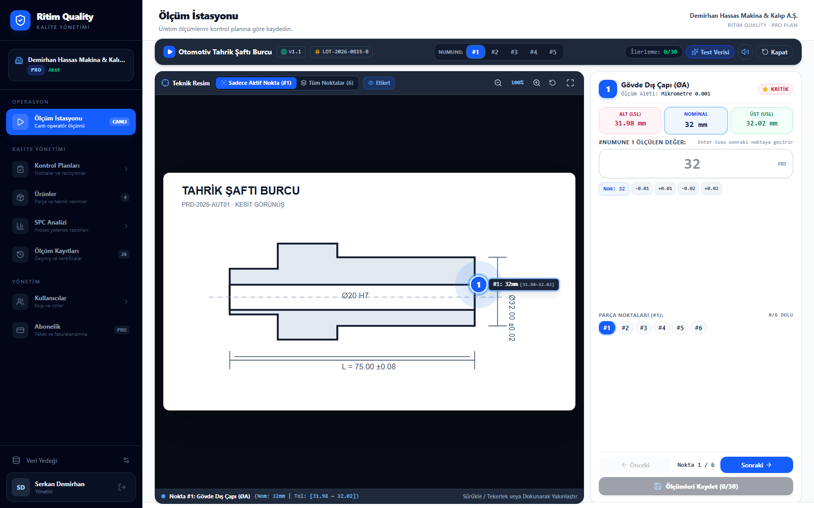
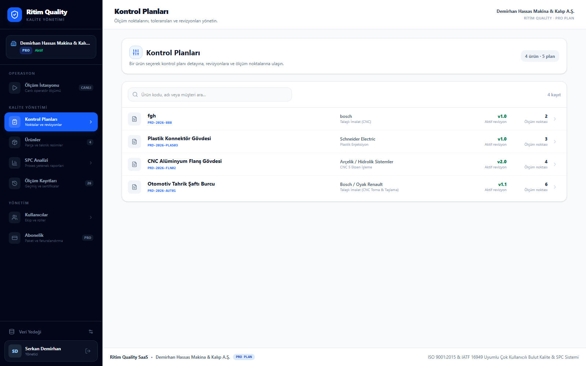
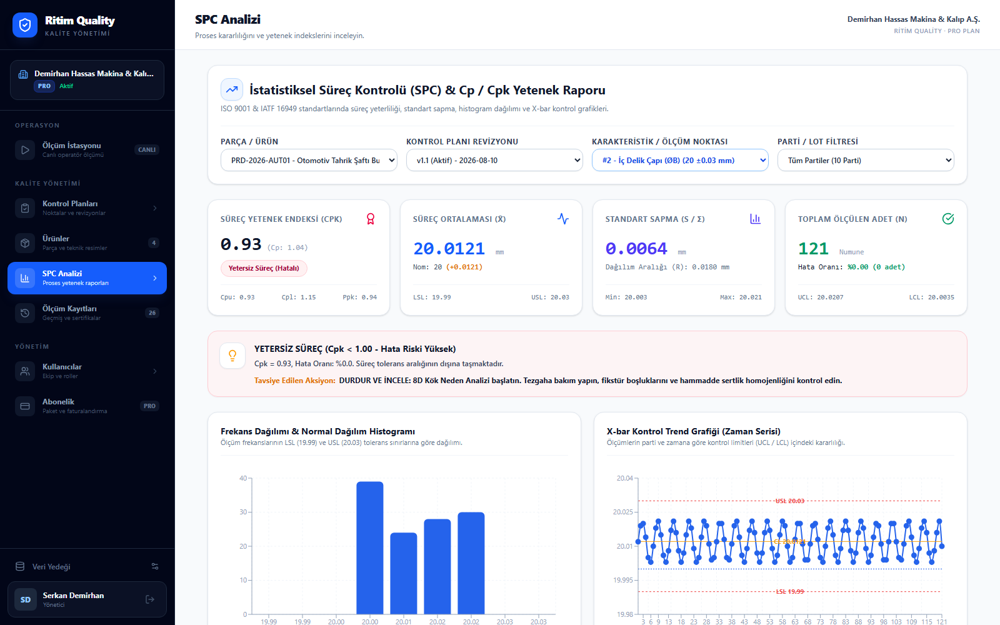

# Ritim Quality tanıtım e-postası

## Konu satırı seçenekleri

1. Kalite ölçümlerinizi tek yerde yönetin: Ritim Quality
2. Teknik resimden SPC analizine, kalite süreciniz tek ekranda
3. Excel ve dağınık ölçüm kayıtlarının yerine Ritim Quality

## Ön izleme metni

Kontrol planları, operatör ölçümleri, SPC ve izlenebilirlik tek kalite platformunda.

## E-posta metni

Merhaba {{AD}},

Kalite ölçümleri farklı Excel dosyalarında, formlarda ve cihaz çıktılarında kaldığında doğru veriye ulaşmak zorlaşır; raporlama yavaşlar ve geriye dönük izlenebilirlik kaybolur.

**Ritim Quality**, üretim kalite sürecini teknik resimden başlayarak tek bir dijital akışta yönetmenizi sağlar.

- Revizyon kontrollü kontrol planları oluşturun.
- Operatörü teknik resim üzerindeki aktif ölçüm noktasına yönlendirin.
- Sayısal, OK/NOK ve görsel kontrolleri aynı süreçte kaydedin.
- Cp, Cpk, histogram ve kontrol grafiklerini otomatik oluşturun.
- Ürün, lot, seri numarası, operatör ve ölçüm zamanı bazında geriye dönük izlenebilirlik sağlayın.
- On-premise kullanım seçeneğiyle kalite verilerinizi tesisinizde tutun.

### Operatör için sade, üretim için hızlı

Operatör; telefon, tablet veya bilgisayar üzerinden ürünü ve kontrol planını seçer. Teknik resimde vurgulanan noktayı ölçer, sonucu girer ve bir sonraki adıma geçer. Tolerans kontrolü sistem tarafından anında yapılır.

### Kontrol planları ve revizyonlar tek yerde

Her ürünün kontrol noktaları, toleransları, ölçüm yöntemleri ve plan revizyonları merkezi olarak yönetilir. Geçmiş ölçümlerin hangi revizyonla yapıldığı korunur.

### Veriden aksiyona: otomatik SPC

Ölçümler kaydedildikçe süreç ortalaması, standart sapma, Cp/Cpk, histogram ve trend grafikleri otomatik hazırlanır. Böylece proses sapmalarını yalnızca raporlamak yerine erkenden görebilirsiniz.

Ritim Quality'nin fabrikanızdaki kalite sürecine nasıl uyarlanabileceğini birlikte değerlendirelim.

**[Ücretsiz demo planlayın]({{DEMO_URL}})**

Saygılarımızla,

**Ritim Quality Ekibi**  
{{TELEFON}} · {{E_POSTA}} · {{WEB_SITESI}}

---

## Gönderim notları

- `{{AD}}`, `{{DEMO_URL}}`, `{{TELEFON}}`, `{{E_POSTA}}` ve `{{WEB_SITESI}}` alanlarını gönderimden önce doldurun.
- HTML e-postada yerel görsel yollarını, e-posta aracınıza yüklediğiniz görsellerin herkese açık URL'leri veya CID ekleriyle değiştirin.
- Önerilen birincil konu satırı: **Kalite ölçümlerinizi tek yerde yönetin: Ritim Quality**
